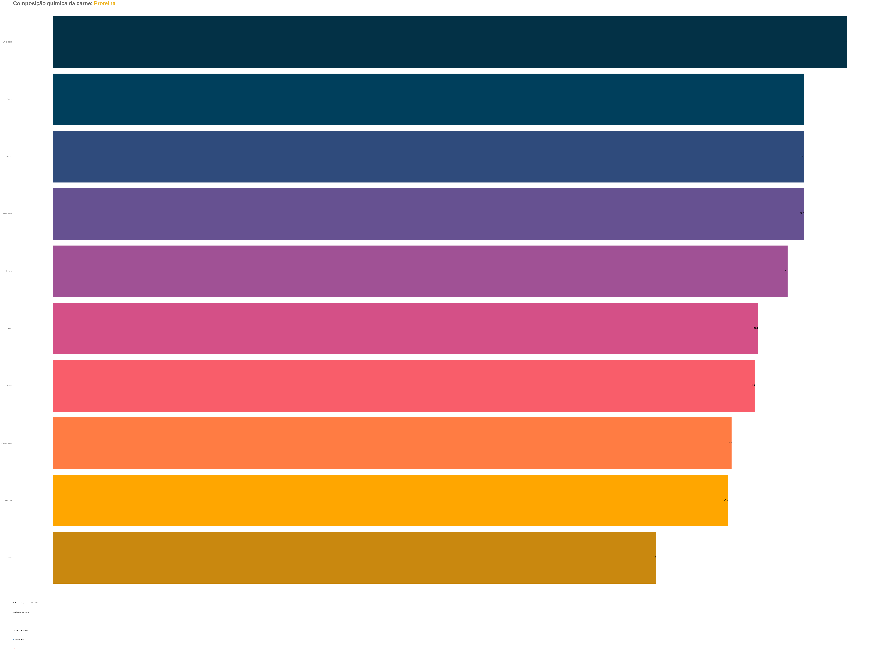

# Web Scraping Carne

## Coleta e Transformação de Dados Não Formatados em Tabelas

##

# Contatos do autor

## Índice

<ul>
        <li><a href="#descricao">Descrição Geral</a></li>
        <li><a href="#objetivo">Objetivo</a></li>
        <li><a href="#dados">Dados</a></li>
        <li><a href="#limpeza">Limpeza</a></li>
        <li><a href="#tabela">Tabela formatada</a></li>
        <li><a href="#visualizacao">Visualização</a></li>
    </ul>

## Descrição Geral

As evidências paleontológicas sugerem que a carne desempenhava um papel significativo na dieta dos primeiros seres humanos [McHugo et al. (2019)](https://www.ncbi.nlm.nih.gov/pmc/articles/PMC6889691/). Ao longo dos anos, a adaptação coevolutiva entre o *Homo sapiens* e espécies como o *Sus scrofa*, o *Ovis aries*, o *Bos taurus*, *Gallus gallus*, entre outros, demonstra que a carne permanece como um alimento de grande importância para os humanos, desempenhando funções essenciais em diversos aspectos.

A Organização das Nações Unidas para Agricultura e Alimentação [(FAO)](https://www.fao.org/3/T0562E/T0562E02.htm#Meat%20quality) define que a composição química da carne envolve principalmente proteínas, minerais, vitaminas, lipídeos (gorduras) e água, cujas proporções variam entre as espécies e desempenham um papel crucial na regulação dos processos fisiológicos do organismo. Dessa maneira, a variedade de nutrientes na carne desempenham funções específicas, contribuindo significativamente para a saúde e o bem-estar. Essa perspectiva destaca a relevância da carne na dieta humana, evidenciando seus benefícios em diferentes aspectos fisiológicos e nutricionais, conforme indicado pela [FAO](https://www.fao.org/3/y2770e/y2770e07.htm).

## Objetivo

O objetivo deste projeto é realizar [*web scraping*](https://pt.wikipedia.org/wiki/Coleta_de_dados_web) utilizando a [linguagem de programação R](https://www.r-project.org/) para extrair dados relacionados à carne. Esses dados serão obtidos em condições reais do cotidiano de um analista, refletindo alguns dos desafios comuns, como formatos não estruturados, presença de dados duplicados, ausência de padrões e outras condições que demandarão limpeza e tratamento adequados para futuras visualizações e *insights*.

> [!NOTE]
>É fundamental adotar abordagens eficientes e éticas no web scraping, respeitando os termos de serviço dos sites fonte e garantindo a integridade dos dados coletados.

Ao enfrentar essas condições, o foco será aplicar técnicas de manipulação de dados, limpeza e transformação por meio de pacotes e funções disponíveis no universo [*tidyverve*](https://www.tidyverse.org/) do R.

## Dados

Os dados desse projeto provém da página da [Wikipédia-Carne](https://pt.wikipedia.org/wiki/Carne).

>[!CAUTION]
>Ao utilizar dados provenientes da Wikipédia, é importante considerar a natureza colaborativa da plataforma, onde informações podem ser atualizadas e modificadas ao longo do tempo sem revisão por pares.

<!--Tabela orginal é de autoria do [Prof. Roberto de Oliveira Roça](https://www.fca.unesp.br/Home/Instituicao/Departamentos/Gestaoetecnologia/Teses/Roca102.pdf) Departamento de Gestão e Tecnologia Agroindustrial da F.C.A. - UNESP - Campus de Botucatu -->

A tabela a seguir apresenta dados da composição química (g/100g) e conteúdo energético (Kcal/100g) médio da carne magra e da gordura de diversos animais após o abate.
|Tipo de carne     | Água   | Proteína| Gordura| Minerais | Conteúdo energético
| :---             | :---:  | :---:   | :---:  | :---:    | :---:
| Bovina           | 75,0   |  22,3   |  1,8   | 1,2      | 116 Kcal
| de vitelo        | 76,4   |  21,3   |  0,8   | 1,2      | 98 Kcal
| de cervo         | 75,7   |  21,4   |  1,3   | 1,2      | 103 Kcal
| de frango (peito)| 75,0   |  22,8   |  0,9   | 1,2      | 105 Kcal
| de frango (coxa) | 74,7   |  20,6   |  3,1   | ---      | 116 Kcal
| de peru (peito)  | 73,7   |  24,1   |  1,0   | ----     | 112 Kcal
| de peru (coxa)   | 74,7   |  20,5   |  3,6   | ---      | 120 Kcal
| pato             | 73,8   |  18,3   |  6,0   | ---      | 132 Kcal
| ganso            | 68,3   |  22,8   |  7,1   | ---      | 161 Kcal
| Gordura de suíno | 7,7    |  2,9    |  88,7  | 0,7      | 812 Kcal
| Gordura de Bovino| 4,0    |  1,5    |  94,0  | 0,1      | 854 Kcal
| Suína            | 75,1 g |  22,8 g |  1,2 g | 1,0 g    | 112 Kcal
             

A correção do formato dos dados disponíveis possibilitará a manipulação e compreensão mais abrangente das informações sobre à carne, abrangendo aspectos como classificações e visualização gráfica de informações relevantes presentes na fonte fornecida.

A análise resultante proporcionará insights valiosos sobre à carne, contribuindo para uma compreensão mais aprofundada dos seus componentes químicos.

## Limpeza

Demosntrado na tabela e apesar de poucas informações (quantidae de dados) temos vários aspectos importantes do dia a dia, com separador decimal com virgula (o R por exemplo endederá isso com uma variavel caracter), assim como, as demais onde temos textos e caracteres especiais.

Utilizei:
*  `stringr::str_replace_all()` para remover todos as ``string``;
*  `base::gsub()` para trocar ``,`` por ``.``;
*  `dplyr::case_when()` para renomear nome de algumas condições se for `true`;
*  `dplyr::rename()` para renomear as colunas.

## Tabela formatada

A versão manipulavel da tabela ficou assim:

|Especie       |  Agua |Proteina | Gordura |Minerais  |Kcal
| :---         | :---: | :---:   | :---:   |  :---:   |:---:
|Suina         |  75.1 |    22.8 |     1.2 |     1    | 112
|Bovina        |  75   |    22.3 |     1.8 |     1.2  | 116
|Vitelo        |  76.4 |    21.3 |     0.8 |     1.2  |  98
|Cervo         |  75.7 |    21.4 |     1.3 |     1.2  | 103
|Frango-peito  |  75   |    22.8 |     0.9 |     1.2  | 105
|Frango-coxa   |  74.7 |    20.6 |     3.1 |          | 116
|Peru-peito    |  73.7 |    24.1 |     1   |          | 112
|Peru-coxa     |  74.7 |    20.5 |     3.6 |          | 120
|Pato          |  73.8 |    18.3 |     6   |          | 132
|Ganso         |  68.3 |    22.8 |     7.1 |          | 161
|Gordura Suino |   7.7 |     2.9 |    88.7 |     0.7  | 812
|Gordura Bovino|   4   |     1.5 |    94   |     0.1  | 854

## Visualização

